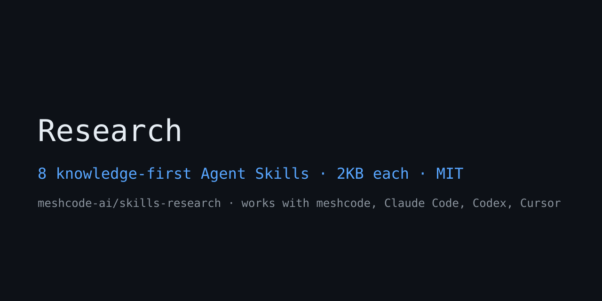

# meshcode-ai/skills-research

**Research skills for Claude Code, Codex, Cursor, and meshcode — deep research, literature review, customer research, survey design, patent landscape analysis, competitor research, dossiers, and research briefs.** The 8 research skills (`res-*`) are distilled editions containing **judgment knowledge only**, with no scripts or install procedures: source credibility tiers (primary > official reports > industry > press), literature screening criteria, survey sample-size formulas, patent IPC/CPC analysis methods, and a fixed output contract (`## Output`) for every skill. They follow the Agent Skills standard (agentkills.io) — just unzip them into your project's `.meshcode/skills/` in a flat layout, and Claude Code, Codex, Cursor, and meshcode desktop will pick them up automatically from the next session onward.

## Who this is for

- **PMs and planners** — quickly turn competitor analysis, customer research, and survey plans into evidence-backed documents
- **Researchers and consultants** — literature review and patent landscapes as reproducible procedures
- **Startup founders** — company and people dossiers before investor meetings, validating market hypotheses with surveys
- **AI agent operators** — a collection of knowledge-first skills ready to publish to stores and registries

## TOC

- [Skill list](#skill-list)
- [Install](#install)
- [Skill details](#skill-details)
- [Hub & related repos](#hub--related-repos)
- [Use with meshcode](#use-with-meshcode)

## Skill list

| Skill | Role | Core judgment criteria |
|---|---|---|
| `res-deep-research` | Multi-source synthesis research | Credibility tiers 1–4, conflict resolution rules |
| `res-litreview` | Literature review | PRISMA screening, finding-level synthesis |
| `res-customer-research` | Customer & user research | JTBD translation, 5 bias checks |
| `res-survey-design` | Survey design | Sample-size formula (n≈384), non-response bias |
| `res-patent-landscape` | Patent landscape | IPC/CPC classification search, CR5 · 3 FTO elements |
| `res-competitor-research` | Competitor analysis | Complaint frequency, moat judgment, price normalization |
| `res-dossier` | Company & people dossiers | [F/E/I] tags, mandatory unverified section |
| `res-research-brief` | Research plans | Decision sentence, success criteria agreed in advance |

## Install

1. Download the zip → extract into your project's `.meshcode/skills/` (keep the folder flat: `.meshcode/skills/res-deep-research/SKILL.md`)
2. Start a new Claude Code · Codex · Cursor · meshcode session → skills are exposed automatically
3. Full catalog at the hub: [github.com/meshcode-ai/skills](https://github.com/meshcode-ai/skills)

## Skill details

### res-deep-research
> Multi-source deep research with citation-grade synthesis — frames the question, gathers primary/official sources, resolves conflicts, delivers a sourced verdict. Use when the user says "deep research", "research this thoroughly", "investigate this for me", "research request"…

### res-litreview
> Structured literature review — search strategy, inclusion/exclusion screening, quality appraisal, and synthesis map of a research field. Use when the user says "literature review", "prior work review", "literature search"…

### res-customer-research
> Customer and user research — interview guides, JTBD framing, evidence-based insight synthesis, and bias controls. Use when the user says "customer research", "user research", "customer interview"…

### res-survey-design
> Survey and questionnaire design — sampling plan, sample-size math, question wording, order and non-response bias checks, analysis-ready instrument. Use when the user says "survey design", "questionnaire design", "sample size"…

### res-patent-landscape
> Patent landscape and freedom-to-operate analysis — IPC/CPC classification mapping, assignee and citation clustering, white-space and risk screening. Use when the user says "patent landscape", "patent analysis", "FTO"…

### res-competitor-research
> Competitor research — systematic profiling of rivals' product, pricing, positioning, GTM, and moat with evidence-graded comparison tables. Use when the user says "competitor analysis", "benchmark"…

### res-dossier
> Structured dossier building — entity briefing packs on companies or people with verified facts, timeline, network map, and open questions. Use when the user says "dossier", "company profile", "person research"…

### res-research-brief
> Research brief writing — turns a fuzzy topic into a scoped, decision-oriented brief with questions, success criteria, and an executable plan others can run. Use when the user says "research brief", "research plan"…

## Hub & related repos

- Hub catalog: **[github.com/meshcode-ai/skills](https://github.com/meshcode-ai/skills)** (llms.txt · index.json · robots.txt)
- [skills-seo](https://github.com/meshcode-ai/skills-seo) — 7 SEO/AEO skills
- Planned: skills-marketing · skills-copy · skills-ops · skills-biz · skills-exec (rolling releases under the same spec)

## Use with meshcode

These skills are built for [meshcode](https://meshcode.ai?utm_source=github&utm_medium=org_readme&utm_campaign=gh_skills-research) (free download — macOS/Windows):

1. Open your project in meshcode
2. In chat, ask **"show available skills"**, then **"install the research skills"** — meshcode fetches from this repo automatically, no git or terminal needed
3. They appear in the next session and load only when a task matches, so installing all of them stays cheap

Manual alternative: download this repo's zip and extract into your project's `.meshcode/skills/`. Also works in Claude Code (`~/.claude/skills/`), Codex, and Cursor.

